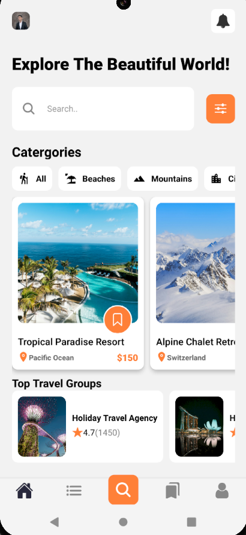
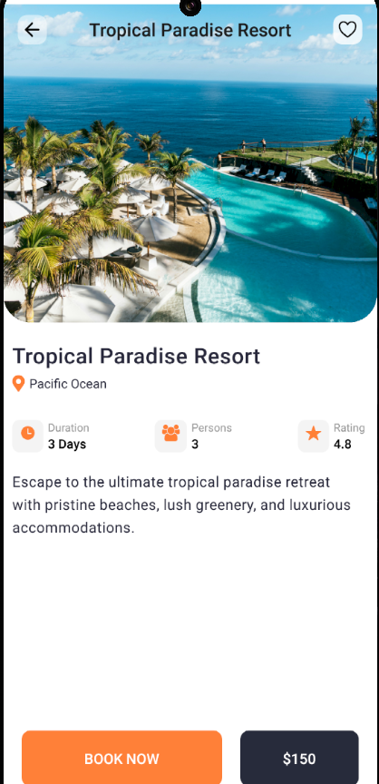
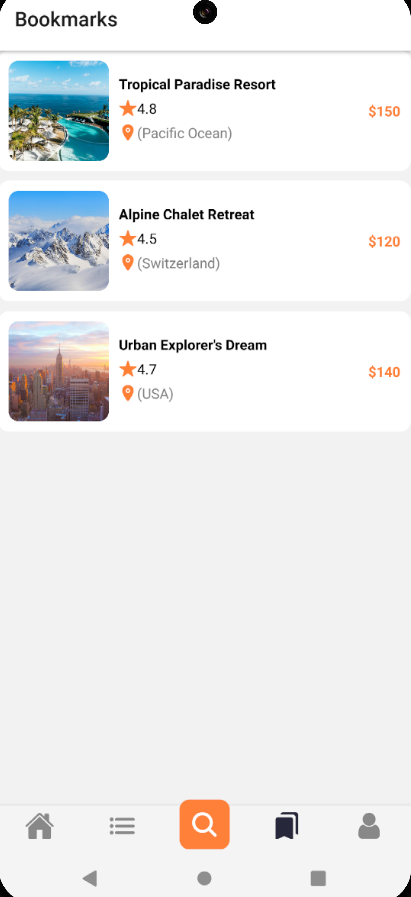

# 🛍️ Yatrika – A Modern Travel Companion App

Yatrika is a beautifully designed travel app built with **React Native** and **Expo Router**. Inspired by the diversity of Indian travel, it allows users to explore, bookmark, and plan travel destinations with ease — whether it's a cultural heritage site, nature getaway, or spiritual retreat.

---

## 🚀 Features

* 🔍 Browse curated travel destinations (offline supported)
* ❤️ Bookmark destinations using `AsyncStorage`
* 🧱 Navigate through app using Expo Router (file-based navigation)
* 🌙 Dark-themed profile and settings screen
* 📱 Optimized responsive UI for Android and iOS
* 🗂 Modular and scalable component architecture

---

## 🛠️ Tech Stack

| Tech                      | Description                          |
| ------------------------- | ------------------------------------ |
| React Native              | Core framework for mobile app        |
| Expo                      | Development and build tooling        |
| Expo Router               | File-based routing for navigation    |
| TypeScript                | Static typing                        |
| AsyncStorage              | Persistent local storage (bookmarks) |
| React Native Vector Icons | Icon library for UI elements         |
| JSON data                 | Static data source for destinations  |

---

## 🧱 Project Structure

```
Yatrika/
├── app/
│   ├── index.tsx             # Home screen
│   ├── (tabs)/               # Tab group screens
|   |   └── index.tsx         # User profile/settings
│   │   └── bookmarks.jsx     # User profile/settings
|   |   └── profile.tsx       # User profile/settings
│   └── listing/[id].tsx      # Dynamic listing detail page
├── components/               # Reusable UI components
│   └── CatergoryButtons.tsx
│   └── GroupListings.tsx
│   └── Listings.tsx
│   └── SettingComponent.tsx
├── constants/                # Theme colors, fonts
│   └── Colors.ts
├── data/
│   └── destinations.json     # Static dataset
│   └── groups.json           # Static dataset
│   └── categories.ts         # Static categories
├── assets/
│   └── image/Me.jpg          # Profile image and other assets
└── README.md
```

---

## 📸 Screenshots

> <video controls src="Yatrika.mp4" title="Title"></video>
---

## 🔧 Getting Started

### Prerequisites

* [Node.js](https://nodejs.org/)
* [Expo CLI](https://docs.expo.dev/get-started/installation/)
* Git

### Installation

```bash
git clone https://github.com/your-username/yatrika.git
cd yatrika
npm install
npx expo start
```

> The app should open in Expo Go on your mobile device or emulator.

---

## 📦 Using the App

* Open the app → Explore travel destinations
* Tap a destination → View details
* Tap the ❤️ icon → Add/remove bookmark (saved in local storage)
* Open profile tab → View user settings UI

---

## 🦚 Local Storage with AsyncStorage

Bookmarks are saved using:

```ts
import AsyncStorage from "@react-native-async-storage/async-storage";
```

Saved IDs are stored and retrieved using `getItem` and `setItem` as JSON arrays.

---

## 🚧 Upcoming Features

* 🔐 User Authentication (OAuth + Firebase)
* 🌐 Real-time destination feed via API
* 🗒️ Trip planner and itinerary builder
* 🗺️ Map view with navigation integration
* 💬 Community tips & reviews

---

## 🤝 Contributing

Contributions are welcome! Please follow these steps:

1. Fork the repository
2. Create a new branch: `git checkout -b feature-name`
3. Commit your changes: `git commit -m 'Added feature'`
4. Push to the branch: `git push origin feature-name`
5. Open a pull request

---

## 📄 License

MIT License. See `LICENSE` for details.

---

## 📬 Contact

Made with ❤️ by [Arpit Rai](mailto:arpitrai1809@gmail.com)
Follow the project and share feedback!

\#ReactNative #Expo #TypeScript #MobileApp #Yatrika #IndieDev
